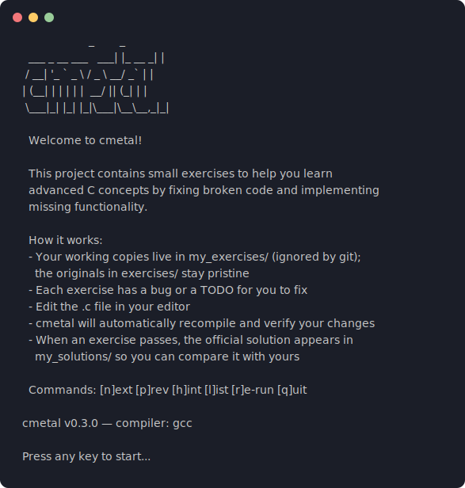
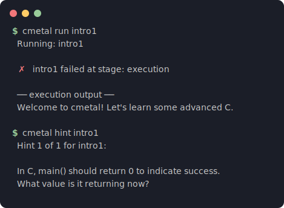

[](https://github.com/cdelmonte-zg/cmetal/actions/workflows/ci.yml)
[](https://cdelmonte-zg.github.io/cmetal/)
[](https://crates.io/crates/cmetal)

```
                     _        _ 
  ___ _ __ ___   ___| |_ __ _| |
 / __| '_ ` _ \ / _ \ __/ _` | |
| (__| | | | | |  __/ || (_| | |
 \___|_| |_| |_|\___|\__\__,_|_|
```

**Small exercises to learn advanced C concepts.** (formerly known as
*clings*)

Inspired by [rustlings](https://github.com/rust-lang/rustlings) --
fix broken C code, learn by doing.

The CLI is written in Rust for a fast, cross-platform experience;
the exercises are pure C11.

📖 **[Documentation](https://cdelmonte-zg.github.io/cmetal/)** — install,
the watch-mode loop, the curriculum, and how verification works.

---

## Screenshots





*Edit a `.c` file -- save -- cmetal recompiles -- read the hint -- fix -- green.*

---

## Prerequisites

- **gcc** and/or **clang** (C11 support required)
- **git** and the **Rust toolchain** — only to contribute or build from
  source (option 3 below); learning needs neither

## Install

### Option 1: Homebrew (macOS / Linux, no Rust required)

```bash
brew install cdelmonte-zg/tap/cmetal
```

### Option 2: Cargo (crates.io)

With a Rust toolchain installed:

```bash
cargo install cmetal
```

### Option 3: prebuilt binary (no Rust required)

Download the archive for your platform from the
[latest release](https://github.com/cdelmonte-zg/cmetal/releases/latest),
then:

```bash
tar -xzf cmetal-<version>-<target>.tar.gz
sudo mv cmetal-<version>-<target>/cmetal /usr/local/bin/
```

Then create a workspace (see below) or clone this repository.

> **macOS:** the binaries are not code-signed yet; if Gatekeeper blocks
> the first run, clear the quarantine flag with
> `xattr -d com.apple.quarantine $(which cmetal)`.

### Option 4: build from source

```bash
git clone https://github.com/cdelmonte-zg/cmetal.git
cd cmetal
cargo install --path .
```

### Create a workspace — no clone needed

The binary embeds the full curriculum. Wherever you installed it from,
this is all it takes:

```bash
cmetal init my-cmetal-course   # or just `cmetal init`
cd my-cmetal-course
cmetal
```

Cloning the repository still works exactly as before and remains the
way to contribute exercises or follow unreleased changes; for learning,
`cmetal init` is the shortest path.

## Upgrade

New exercises ship with the binary. Upgrade it, matching how you
installed it:

```bash
brew upgrade cmetal              # Homebrew
cargo install cmetal             # crates.io (picks up the newest release)
cargo install --path . --force   # built from source
```

If you installed a prebuilt binary, download the new archive from the
[latest release](https://github.com/cdelmonte-zg/cmetal/releases/latest)
and replace `/usr/local/bin/cmetal` the same way you installed it.

Then reconcile your workspace with the new curriculum:

```bash
cd my-cmetal-course
cmetal update
```

`update` never overwrites work you have edited: untouched working
copies are refreshed, edited ones are kept and reported — compare with
`cmetal diff <name>` or take the new version with `cmetal reset <name>`.
(In a git checkout, update with `git pull` instead.)

## Uninstall

Remove the binary, matching how you installed it:

```bash
brew uninstall cmetal            # Homebrew
sudo rm /usr/local/bin/cmetal    # prebuilt binary
cargo uninstall cmetal           # crates.io or built from source
```

Everything else — your progress, `my_exercises/`, revealed solutions —
lives inside your workspace (or clone): delete that directory and no
trace is left.

## Getting started

### I want to learn C

```bash
brew install cdelmonte-zg/tap/cmetal      # or any install option above
cmetal init my-cmetal-course
cd my-cmetal-course
cmetal
```

On first run cmetal copies the exercises into `my_exercises/` — that's
where you work; the pristine exercises in `exercises/` stay untouched.
(A git clone of this repository works exactly the same way.)

Each exercise has a bug or a `TODO` for you to fix: open the `.c` file
under `my_exercises/` in your editor, save your changes, and cmetal
recompiles and verifies automatically. Stuck? Press `h` for progressive
hints. When an exercise passes, the official solution is revealed in
`my_solutions/` so you can compare it with yours (solutions are stored
obfuscated — no accidental spoilers while browsing the repo).

### I'm coming back after a break

Just run `cmetal` again from your workspace — progress persists across
sessions. `cmetal list` shows where you left off, `cmetal solution
<name>` re-opens any solution you've already earned, and `cmetal reset`
wipes progress and restores the pristine exercises if you want to start
over.

### I want to contribute an exercise

Fork the repo and read [CONTRIBUTING.md](CONTRIBUTING.md): you'll write
a broken `.c` file, its solution, and hints in `info.toml`. Two tools do
the quality control for you:

```bash
python3 scripts/solutions_codec.py unpack   # edit solutions in plaintext
python3 scripts/check_exercises.py          # the invariant gatekeeper
```

[VISION.md](VISION.md) lists the topics we most want covered.

### Interactive commands

| Key | Action                        |
|-----|-------------------------------|
| `n` | Next exercise                 |
| `p` | Previous exercise             |
| `h` | Show hint (additive)          |
| `l` | List all exercises            |
| `r` | Re-run current exercise       |
| `q` | Quit                          |

### CLI subcommands

```bash
cmetal init [dir]            # create a self-contained workspace
cmetal update                # sync workspace with the binary's curriculum
cmetal diff <name>           # your working copy vs the pristine exercise
cmetal run <name>            # run a specific exercise
cmetal hint <name> --level 2 # show first 2 hints
cmetal solution <name>       # reveal the solution (once solved)
cmetal list                  # list exercises and progress
cmetal verify                # verify all exercises
cmetal reset [name]          # all: clear progress; one: restore its file
```

---

## How it works

1. cmetal reads `info.toml` to discover exercises and their metadata.
2. In watch mode it monitors your `my_exercises/` workspace for file changes.
3. On each save it compiles the exercise with `gcc` (or `clang`),
   runs the binary, and optionally runs unit tests (`-DTEST`)
   and sanitizers (`-fsanitize=address,undefined`).
4. Results are shown immediately in the terminal.
5. Progress is saved to `.cmetal-state.txt` and persists across sessions.

---

## Exercises (62 total)

| Topic                 | #  | What you will learn                                 |
|-----------------------|----|-----------------------------------------------------|
| 00 Intro              | 1  | Getting started, basic program structure             |
| 01 Pointers           | 2  | Decay, arithmetic, pointer-size pitfalls             |
| 02 Memory             | 3  | `malloc`/`free`, `realloc`, leaks, double-free       |
| 03 Undefined Behavior | 4  | Signed overflow, sequence points, promotions, stack lifetimes |
| 04 Preprocessor       | 1  | Stringify, token pasting, macro pitfalls             |
| 05 UB Lab             | 6  | Hands-on UB experiments with sanitizer feedback      |
| 06 Strings            | 3  | Safe concatenation, tokenizing, parsing              |
| 07 Structs            | 3  | Layout/padding, opaque types, linked lists           |
| 08 Function Pointers  | 3  | Callbacks, generic sort, dispatch tables             |
| 09 Const Correctness  | 3  | `const` parameters, pointer-to-const, immutable API  |
| 10 Error Handling     | 3  | Return codes, error propagation, error context       |
| 11 Bitwise            | 3  | Bit counting, packing/unpacking, bit tricks          |
| 12 Encodings          | 3  | Endianness, varints, bit packing — bytes on the wire |
| 13 Tagged Unions      | 4  | Tag discipline, exhaustive dispatch, ownership, header-first polymorphism |
| 14 Hash Tables        | 5  | FNV-1a, probing, tombstones, rehash on growth, interning |
| 15 Arenas             | 3  | Bump allocation, alignment, chained growth, escape discipline |
| 16 Garbage Collection | 3  | Mark-sweep: reachability, cycles, sweep discipline, finalization |
| 17 NaN Boxing         | 3  | IEEE-754 bit layout, legal punning, mask discipline, payload packing |
| 18 Bytecode Dispatch  | 3  | Defensive stream decoding, refusable stacks, jump-table discipline |
| 19 Capstone           | 3  | A binary format end to end: writing, validating, owning |

---

## Features

- **Watch mode** -- recompiles on every save, shows errors instantly
- **gcc + clang** -- pick at startup with `--compiler clang`; exercises
  that rely on compiler-specific diagnostics declare it and are skipped
  (shown as "requires gcc" in the list) instead of passing vacuously
- **Sanitizers** -- AddressSanitizer and UBSan catch hidden bugs
- **Progressive hints** -- press `h` repeatedly, hints accumulate
- **UB Lab** -- dedicated exercises where you trigger real undefined behavior
  and observe how sanitizers detect it

## Development

```bash
cargo test                           # Rust unit + integration tests
cargo clippy                         # lint
cargo build --release                # optimized build
python3 scripts/check_exercises.py   # every exercise must fail as
                                     # shipped, every solution must pass
```

See [CONTRIBUTING.md](CONTRIBUTING.md) for how to add exercises and
[VISION.md](VISION.md) for where the project is headed.

## License

MIT
